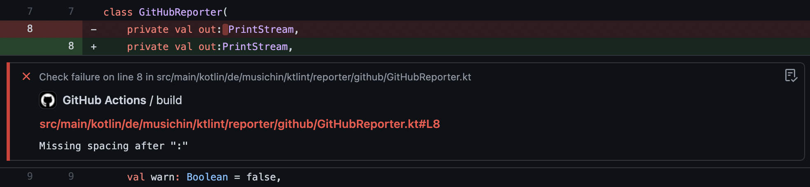

# ktlint-check
[](https://github.com/musichin/ktlint-check/actions/workflows/ci.yml)
[](https://codecov.io/gh/musichin/ktlint-check)

## Usage:
See [action.yml](action.yml)

**Basic:**
```yaml
steps:
  - uses: actions/checkout@v2
  - uses: musichin/ktlint-check@v2
    with:
      ktlint-version: '0.49.0'
```
The ktlint `ktlint-version` input is optional, however, it is strongly recommended to always specify it.

**Advanced**
```yaml
steps:
  - uses: actions/checkout@v2
  - uses: musichin/ktlint-check@v2
    continue-on-error: true
    with:
      ktlint-version: '0.49.0'
      level: 'warning'

      # ktlint
      code-style: android_studio
      relative: true
      experimental: true
      reporter: |
        plain,output=ktlint_report.txt
        json,output=ktlint_report.json
      patterns: |
        **/**.kt
        !**/generated/**
```
All relevant ktlint arguments are supported, check `ktlint --help` for more information.

## Example


## License

    MIT License

    Copyright (c) 2021 Anton Musichin

    Permission is hereby granted, free of charge, to any person obtaining a copy
    of this software and associated documentation files (the "Software"), to deal
    in the Software without restriction, including without limitation the rights
    to use, copy, modify, merge, publish, distribute, sublicense, and/or sell
    copies of the Software, and to permit persons to whom the Software is
    furnished to do so, subject to the following conditions:

    The above copyright notice and this permission notice shall be included in all
    copies or substantial portions of the Software.

    THE SOFTWARE IS PROVIDED "AS IS", WITHOUT WARRANTY OF ANY KIND, EXPRESS OR
    IMPLIED, INCLUDING BUT NOT LIMITED TO THE WARRANTIES OF MERCHANTABILITY,
    FITNESS FOR A PARTICULAR PURPOSE AND NONINFRINGEMENT. IN NO EVENT SHALL THE
    AUTHORS OR COPYRIGHT HOLDERS BE LIABLE FOR ANY CLAIM, DAMAGES OR OTHER
    LIABILITY, WHETHER IN AN ACTION OF CONTRACT, TORT OR OTHERWISE, ARISING FROM,
    OUT OF OR IN CONNECTION WITH THE SOFTWARE OR THE USE OR OTHER DEALINGS IN THE
    SOFTWARE.
 