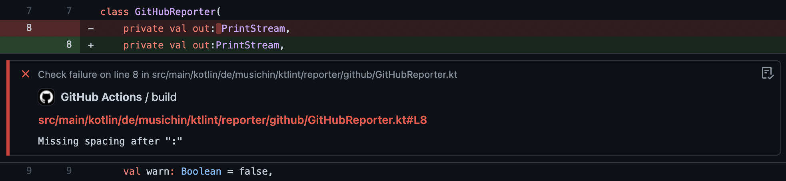

# ✅ ktlint-check
[](https://github.com/musichin/ktlint-check/actions/workflows/ci.yml)
[](https://codecov.io/gh/musichin/ktlint-check)

A lightweight **GitHub Action** that runs [ktlint](https://ktlint.github.io) on your Kotlin code and annotates Pull Requests with inline warnings, errors, or notices — using [GitHub workflow commands](https://docs.github.com/actions/reference/workflow-commands-for-github-actions).

## 🚀 Features

- 🧹 Runs [ktlint](https://ktlint.github.io) to lint Kotlin code.
- 📝 Adds inline annotations directly to GitHub PRs.
- ⚡ Zero setup: Just drop it into your workflow.
- 🔒 **No `GITHUB_TOKEN` or permissions needed** — uses GitHub-native workflow commands.

## 📦 Quick Start
See [action.yml](action.yml)

**Basic:**
```yaml
steps:
  - uses: actions/checkout@v6
  - uses: musichin/ktlint-check@v4
    with:
      ktlint-version: '1.8.0'
```
> ⚠️ Always specify a ktlint-version to avoid surprises.

**Advanced**
```yaml
steps:
  - uses: actions/checkout@v6
  - uses: musichin/ktlint-check@v4
    continue-on-error: true
    with:
      ktlint-version: '1.8.0'
      level: 'warning'

      # ktlint
      code-style: android_studio
      relative: true
      experimental: true
      reporter: |
        plain,output=ktlint_report.txt
        json,output=ktlint_report.json
      patterns: |
        **/**.kt
        !**/generated/**
```
> ℹ️ All relevant ktlint arguments are supported, check `ktlint --help` for more information.

## Example



## 📝 License
MIT License © 2025 Anton Musichin